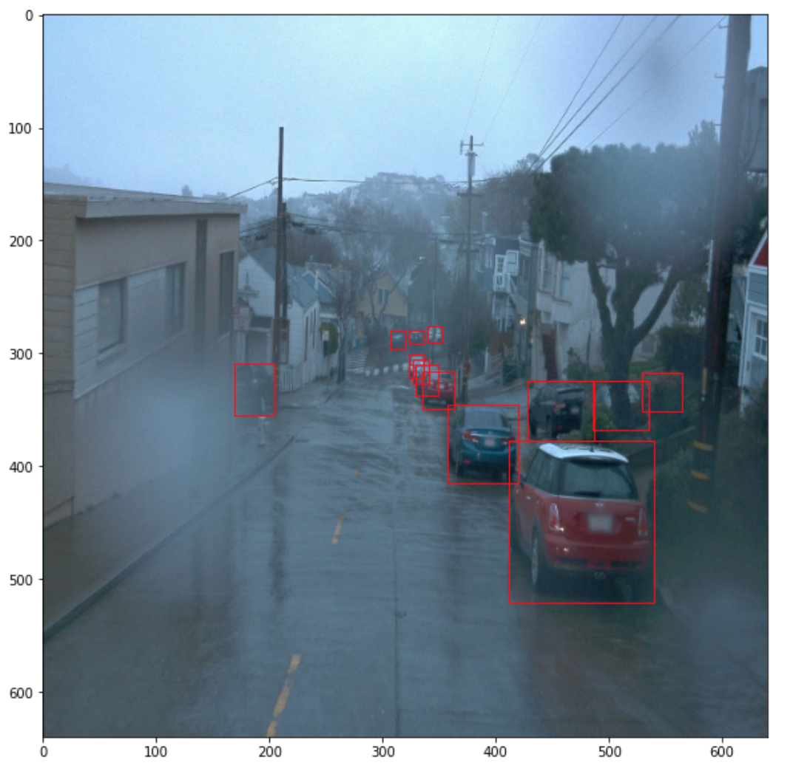
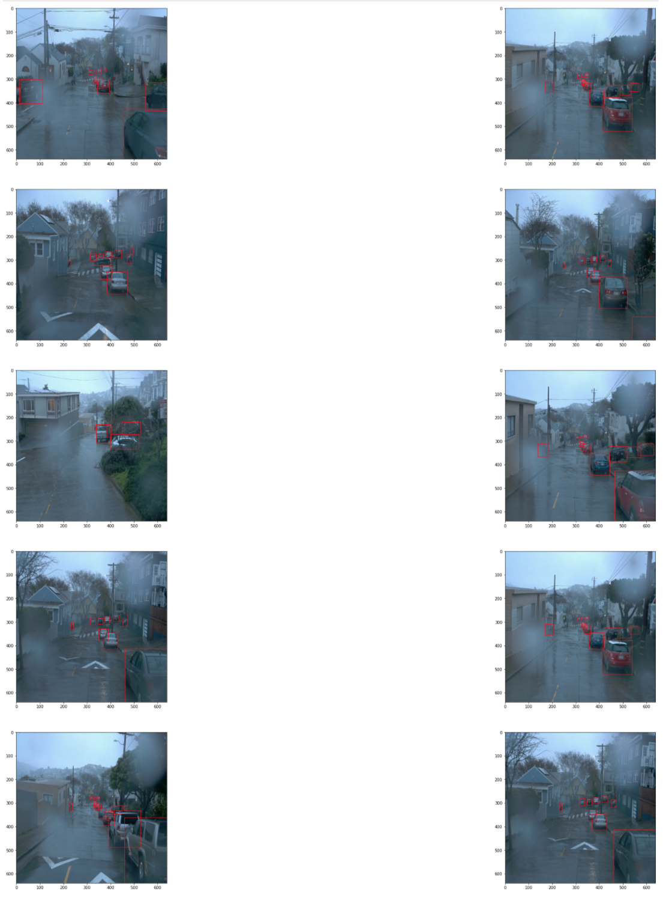
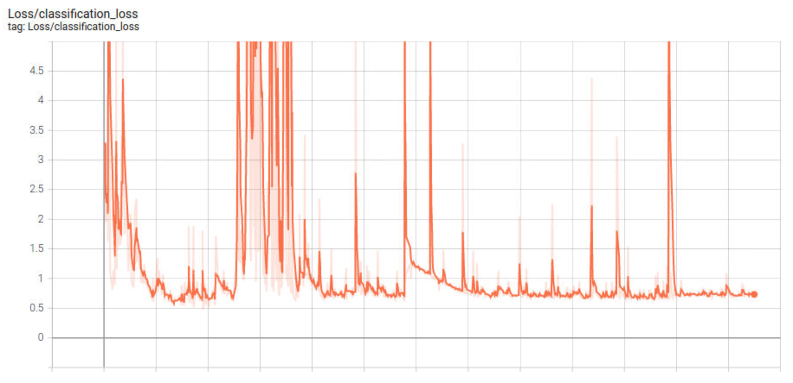
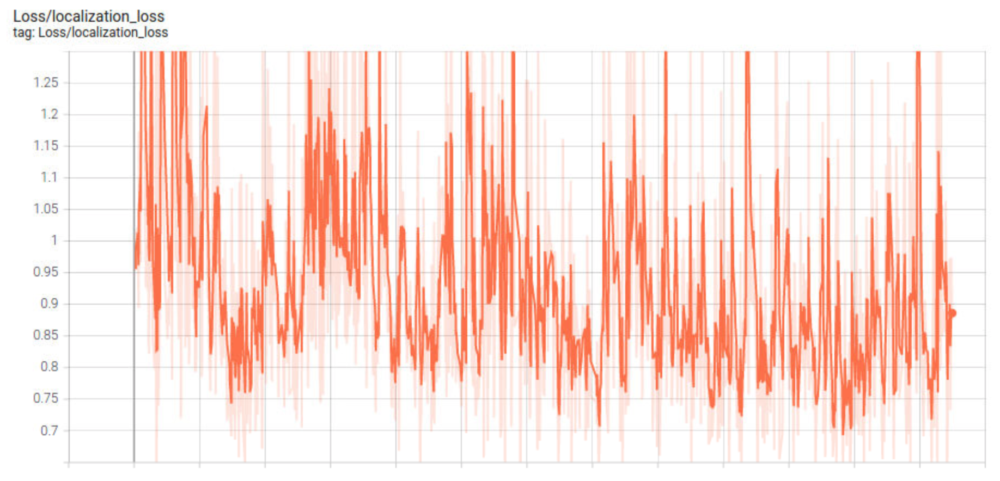
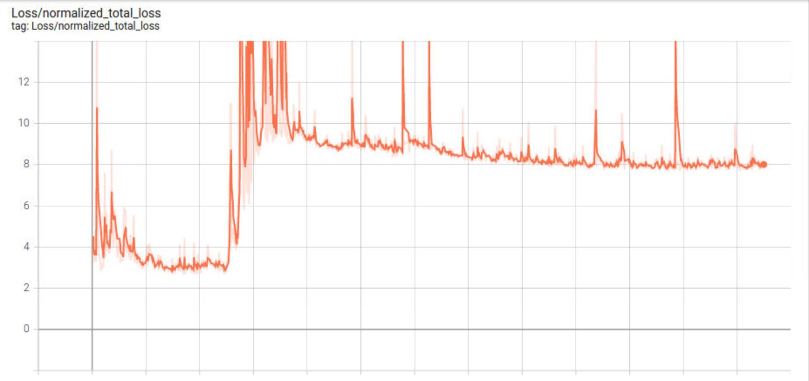
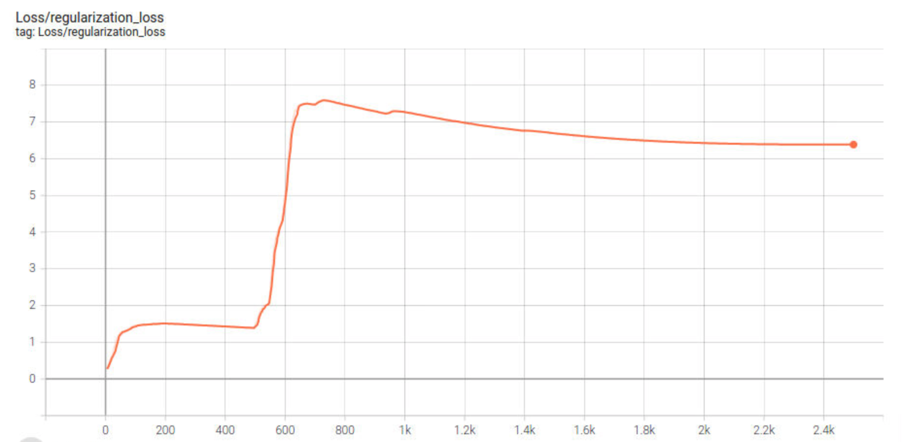
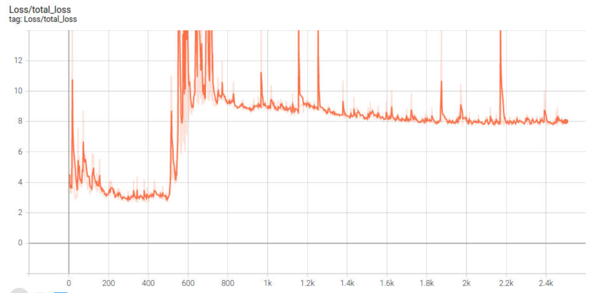
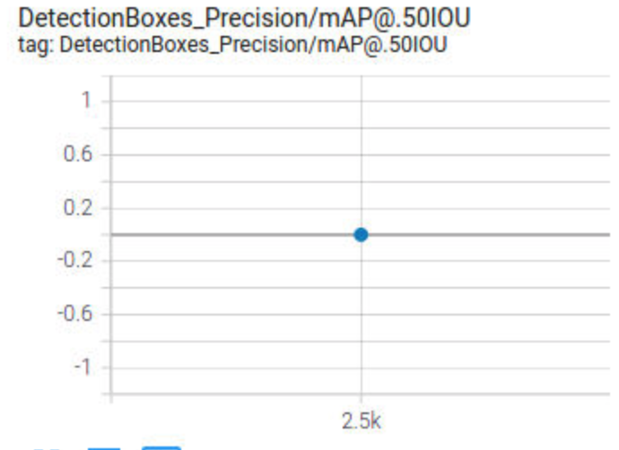
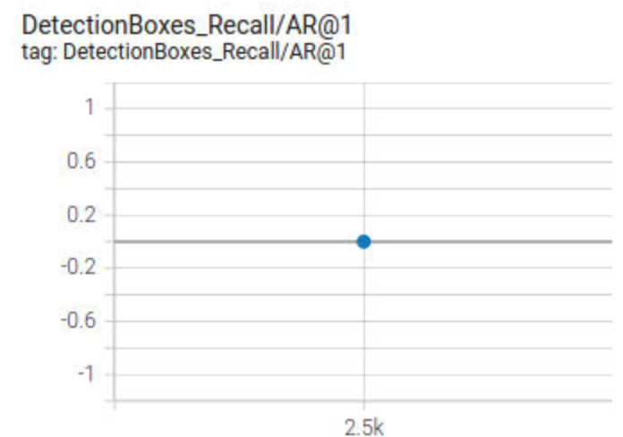

# Project overview
## Description
This project uses Waymo dataset and object detection algorithm from Tensorflow to detect vehicle, pedestrian and cyclist for an urban environment.
## Goal
Goal for this project is to learn about Waymo dataset and to learn about how to use object detection pre-trained model from Tensorflow to detect objects. 
## Object detection in Self Driving Car
Level 5 Driving Automation – Full Driving Automation is goal for every Self Driving Car project. Safety is going to be a big concerns for Self Driving Card. For this it is ver important that Self Driving Car to match the human intelligence to percive objects around it. Correct object detection will help Car to make sure to follow the traffic rule and also to make sure never hit any living animals.
# Set up
Following are two key dependenices to run this program.
1. waymo_open_dataset https://github.com/waymo-research/waymo-open-dataset/blob/master/docs/quick_start.md#local-compilation-without-docker-system-requirements
2. object_detection https://github.com/tensorflow/models/tree/master/research/object_detection

To install object detection, you will need Nvidia GPU. Since I don't have Nvidia GPU therefore I had used Udacity Desktop which is a preconfigured environment to run this project.

# Dataset
## Dataset analysis
A Wamo TfRecord `segment-10017090168044687777_6380_000_6400_000_with_camera_labels.tfrecord` has been analyzed to understand the given dataset. Analysis was done in two phase
### Understand the data strucutre 
First analysis was done to understand the data structure. Following were key points
1. `y1, x1, y2, x2 in bb_boxes` is the types for bonding box data
2. `groundtruth_boxes` given in data was in range of `0-1`, had to multiply by image width i.e. `640` (bcz height and width are same, otherwise had to multiply height and width separately)

Following is one image with bounding box. 


Second analysis was done to display batch of 10 images with bounding box. Following were key observations
1. `figsize=(w, h)` should be smaller. If you keep it high then notebook will take huge amount to render images. I used `figsize=(40, 40)`.
2. 5*2 dimension was used to render top 10 images

Following is output to render 10 images together.


### Apply data augmentation
`object_detection` provides `get_configs_from_pipeline_file` and `train_input` methods which takes `pipeline.config` file and read data from waymo dataset as per config. Following additioanl augmentations are used in `pipeline_augmentation.config` file
```
  data_augmentation_options {
    random_rgb_to_gray {
        probability: 1
    }
  }
```
This produced gray file with bounding box for testing purpose.

## Cross validation
Machine learning model doesn't perform well if same training data is used to evaulate the model performance. Therefore it is a good idea to split data into following three categories.
1. training
Training data is used to train the model. 
2. validation
Validation data is used to evaluate the model performance.
3. test
Testing data is used to test the model.

Following approach is used to perform data split
1. Get list of tf_record files from `training_and_validation` directory
2. Randomly shuffle the tf_records files list
3. Take first 75% for training data
4. Take next 15% for validation data
5. Take rest 10% for testing data
6. Move these files to corresponding folders.

# Training
`ssd_resnet50_v1_fpn_640x640_coco17_tpu-8` object detection model is used to perform the object detection. Following are steps to train model.
1. Download and extract model `ssd_resnet50_v1_fpn_640x640_coco17_tpu-8.tar.gz`
```
wget http://download.tensorflow.org/models/object_detection/tf2/20200711/ssd_resnet50_v1_fpn_640x640_coco17_tpu-8.tar.gz
tar -xf ssd_resnet50_v1_fpn_640x640_coco17_tpu-8.tar.gz
mv ssd_resnet50_v1_fpn_640x640_coco17_tpu-8/checkpoint experiments/pretrained_model/
```
2. Create new pipeline config for model
```
python edit_config.py --train_dir /home/workspace/data/waymo/train/ --eval_dir /home/workspace/data/waymo/val/ --batch_size 2 --checkpoint /home/workspace/experiments/pretrained_model/ssd_resnet50_v1_fpn_640x640_coco17_tpu-8/checkpoint/ckpt-0 --label_map /home/workspace/experiments/label_map.pbtxt
```
3. Train model 
```
python experiments/model_main_tf2.py --model_dir=experiments/reference/ --pipeline_config_path=experiments/reference/pipeline_new.config
```
4. Evalutate model
```
python experiments/model_main_tf2.py --model_dir=experiments/reference/ --pipeline_config_path=experiments/reference/pipeline_new.config --checkpoint_dir=experiments/reference/
```
5. Export trained model
```
python experiments/exporter_main_v2.py --input_type image_tensor --pipeline_config_path experiments/reference/pipeline_new.config --trained_checkpoint_dir experiments/reference/ --output_directory experiments/reference/exported/
```
6. Create animation video
```
python experiments/exporter_main_v2.py --input_type image_tensor --pipeline_config_path experiments/reference/pipeline_new.config --trained_checkpoint_dir experiments/reference/ --output_directory experiments/reference/exported/
```
## Reference experiment
#### Analyze loss
Loss function was very stable at the later phase of training. Following are graphs for few loss.





### Model evaluation on validation dataset
Model performed very bad on validation dataset. Bounding box were not at all generated. Following are few graph for reference.


### Animated video
Since model performance was very bad therefore animated video doesn't show any bonding boxes.


## Improve on the reference
This section should highlight the different strategies you adopted to improve your model. It should contain relevant figures and details of your findings.
